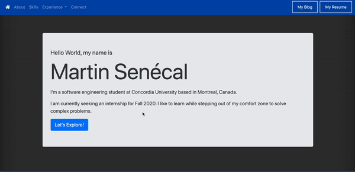
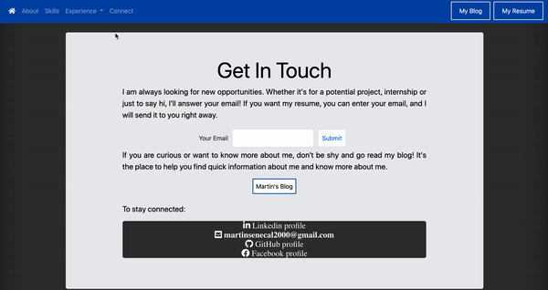
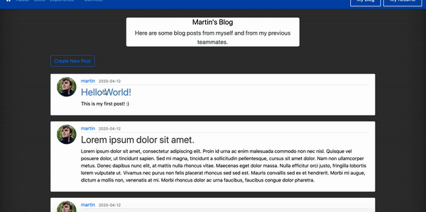

# Martin-SoftwarePortfolio 

> Subtitle or Short Description Goes Here
> ideally one sentence
> include terms/tags that can be searched


## Tests (Optional)
- Going into more detail on code and technologies used
- I utilized this nifty <a href="https://github.com/adam-p/markdown-here/wiki/Markdown-Cheatsheet" target="_blank">Markdown Cheatsheet</a> for this sample `README`.

 
## Tests (Optional)

- Going into more detail on code and technologies used
- I utilized this nifty <a href="https://github.com/adam-p/markdown-here/wiki/Markdown-Cheatsheet" target="_blank">Markdown Cheatsheet</a> for this sample `README`.
 
## Tests (Optional)

- Going into more detail on code and technologies used
- I utilized this nifty <a href="https://github.com/adam-p/markdown-here/wiki/Markdown-Cheatsheet" target="_blank">Markdown Cheatsheet</a> for this sample `README`.
 
## Tests (Optional)

- Going into more detail on code and technologies used
- I utilized this nifty <a href="https://github.com/adam-p/markdown-here/wiki/Markdown-Cheatsheet" target="_blank">Markdown Cheatsheet</a> for this sample `README`.
 

---

## Example (Optional)

```javascript
// code away!

let generateProject = project => {
  let code = [];
  for (let js = 0; js < project.length; js++) {
    code.push(js);
  }
};
```

---

## Installation

- All the `code` required to get started
- Images of what it should look like

### Clone

- Clone this repo to your local machine using `https://github.com/fvcproductions/SOMEREPO`

### Setup

- If you want more syntax highlighting, format your code like this:

> update and install this package first

```shell
$ brew update
$ brew install fvcproductions
```

> now install npm and bower packages

```shell
$ npm install
$ bower install
```

- For all the possible languages that support syntax highlithing on GitHub (which is basically all of them), refer <a href="https://github.com/github/linguist/blob/master/lib/linguist/languages.yml" target="_blank">here</a>.

---
---

## Support

Reach out to me at one of the following places!

- Website at <a href="http://fvcproductions.com" target="_blank">`fvcproductions.com`</a>
- Twitter at <a href="http://twitter.com/fvcproductions" target="_blank">`@fvcproductions`</a>
- Insert more social links here.
